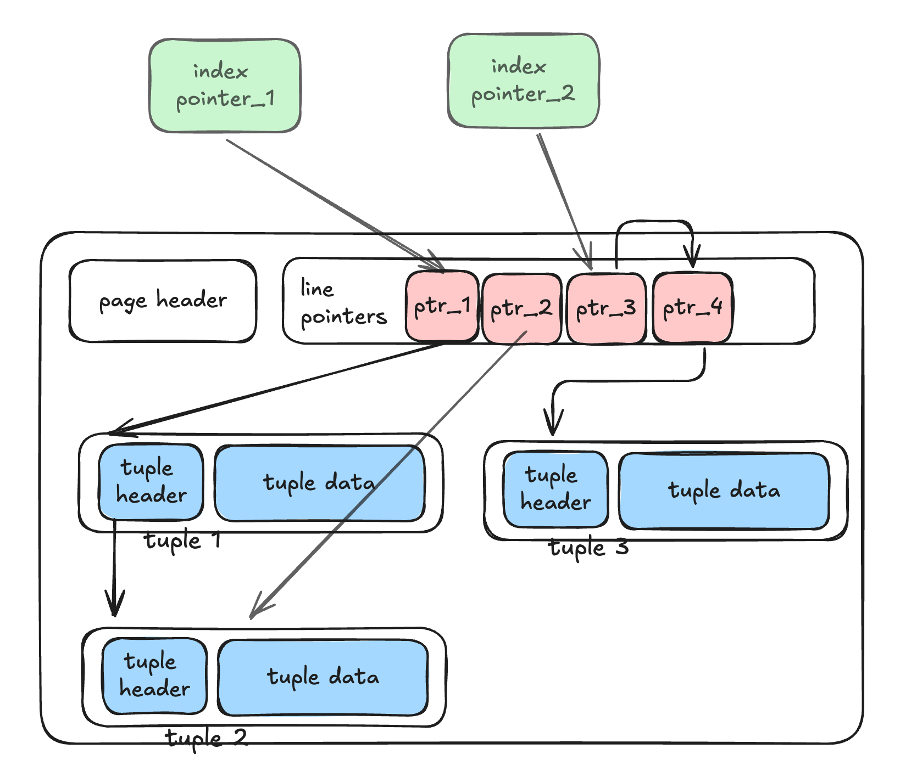
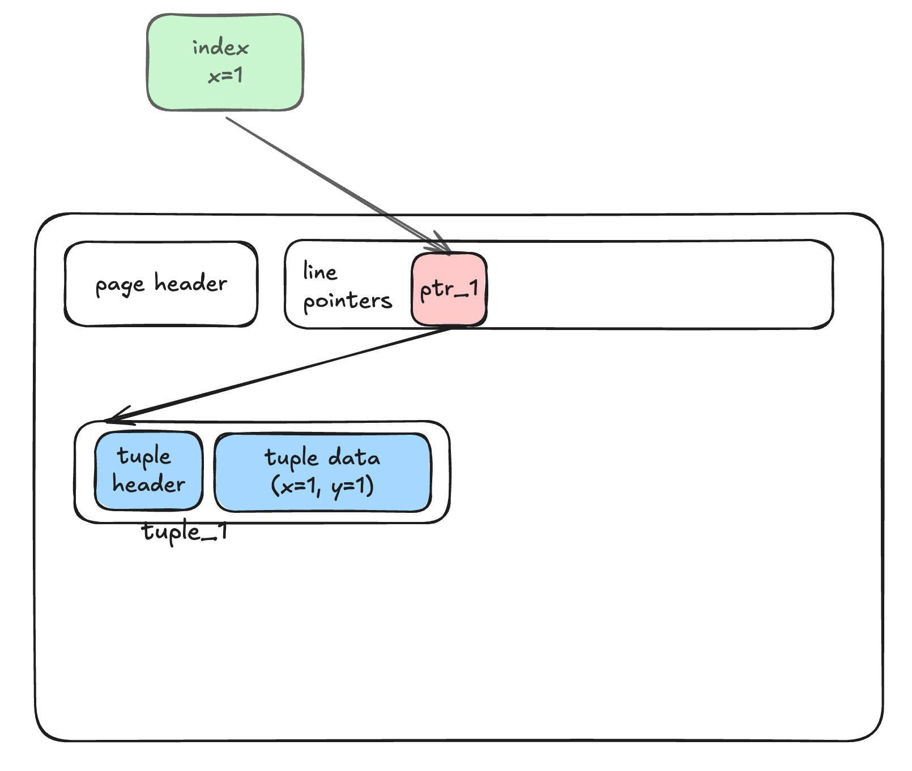
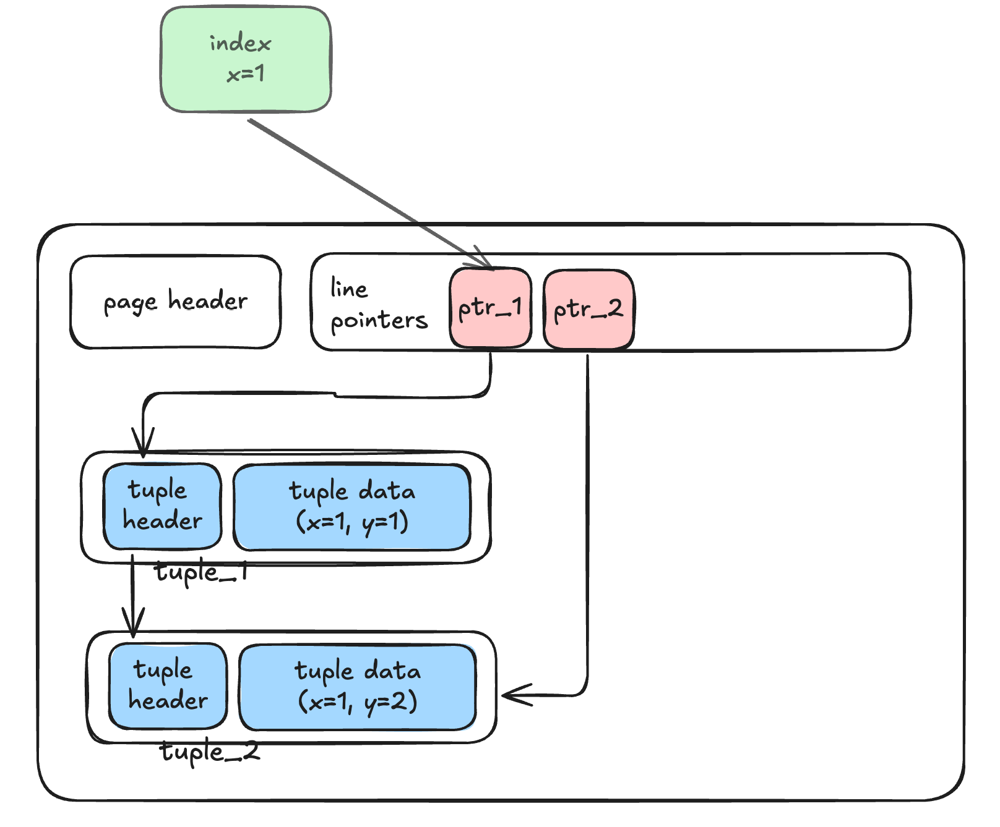
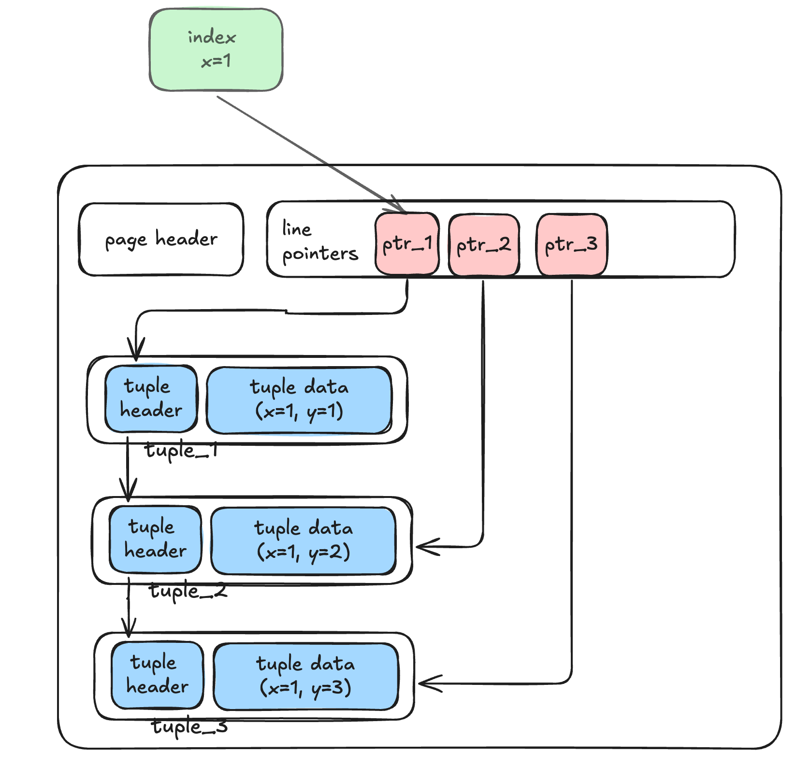
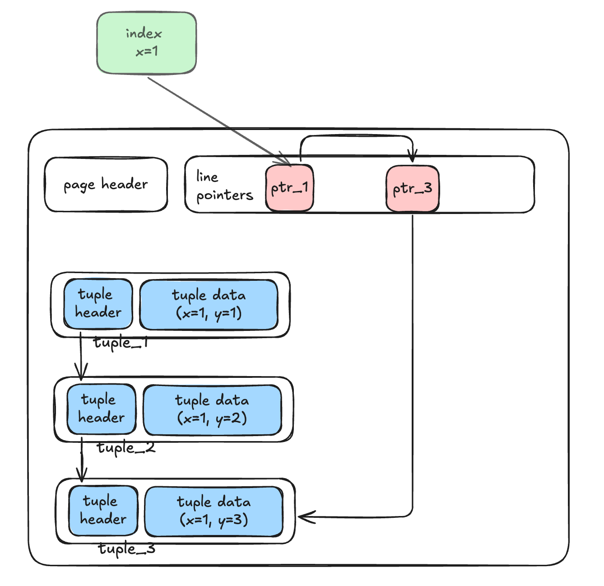
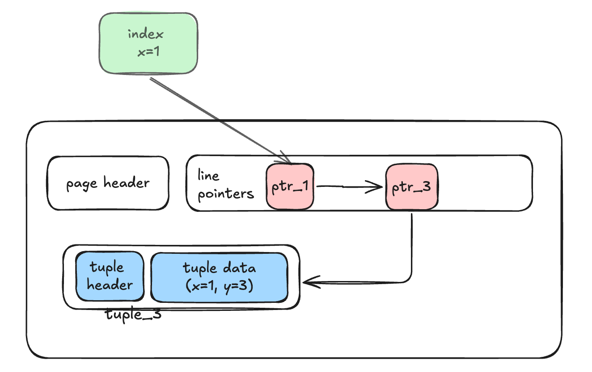

## 概述

简单而言, HOT(Heap Only Tuple) 指没有索引指向的元组 用于消除元组更新引起的索引膨胀，原理如下图所示





1. 索引指向 line_ptr_1 ，line_ptr_1 指向 tuple_1 ，tuple_1 被更新后成为 tuple_2，此时 tuple_1 指向 tuple_2
2. 索引指向 line_ptr_3 , line_ptr_3 指向 line_ptr_4 ，line_ptr_4 指向 tuple3

显然，HOT 技术具有如下优点

1. 对于被更新的元组，无需创建新的索引指针指向新元组
2. 旧元组可以被“普通操作”删除掉，并不一定需要 vacuum

## related posts

[postgreSQL HOT From ZhiHu](https://zhuanlan.zhihu.com/p/455983543)

[OFFICIAL DOC](https://www.postgresql.org/docs/current/storage-hot.html)

For more details , see `postgresql/src/backend/access/heap/README.HOT`

Main Commits:

* `282d2a03dd`  HOT updates
* `6f10eb2111`  Refactor heap_page_prune


## TID

tuple 通过 t_ctid 字段指向其他 tuple


line pointer 通过 offset 指向其对应的 tuple


## HOT 链的构建与清理

### 构建

（一）：表 tbl(x int, y int) 在 x 上有索引，先插入一行  tuple_1=(x=1, y=1) ，结果如下



（二）：当更新 tuple_1 为 (x=1,y=2) 时， 新增 lp_2, 和 tuple_2 ，但是不会新增索引指针，而是由 tuple_1 的 header 会记录 tuple_2 的位置。



从可见性的角度思考，对于一个快照而言，一个 HOT 链上最多只有一个 tuple 可见。

所以使用索引扫描时，会先找到 tuple_1 判断 tuple_ 1 是否符合可见性：

1. 如果 tuple_1 可见，那么立即返回，不在向下搜索。
2. 如果 tuple_1 不可见，再继续向下搜素。


（三）：再更新 tuple_1 为 tuple3=(x=1, y=3)，结果如下



### 清理

显然如果一个tuple一直被更新，那么这个链会很长，影响索引搜索的性能，所以需要去清理 HOT 链，清理分为两步，一个是 pruning （修剪），另一个是 defragmentation （碎片整理）


（四）：pruning （修剪）：等 tuple_1 和 tuple_2 多所有事务都不可见时，则通过修改 line pointers，减少 hot 链的长度。 line pointer 2 可以被其他操作复用，但是 tuple_1 和 tuple_2 占用的空间仍没有被清理。如图：




（五）：defragmentation （碎片整理）：将对应的 tuple 彻底删除，如图



## 清理时机

??（好复杂，后面再说）


# Low Level Design

## Key functions

### heap_page_prune

####  `heap_page_prune_opt` 

> Optionally prune and repair fragmentation in the specified page.

```c
heap_page_prune_opt()
{
  minfree = RelationGetTargetPageFreeSpace();
  minfree = Max(minfree, BLCKSZ / 10);
  
  if (PageIsFull(page) || PageGetHeapFreeSpace(page) < minfree)
  {
    if (!ConditionalLockBufferForCleanup(buffer))
      continue;
    if (PageIsFull(page) || PageGetHeapFreeSpace(page) < minfree)
    {
      heap_page_prune();
    }
  }
}
```

#### `heap_page_prune`

>  Prune and repair fragmentation in the specified page.

```c
heap_page_prune()
{
  for (offnum = FirstOffsetNumber;
       offnum <= maxoff;
       offnum = OffsetNumberNext(offnum))
  {
    heap_prune_chain(&prstate)
  }
  
  if (prstate.nredirected > 0 || prstate.ndead > 0 || prstate.nunused > 0)
  {
    heap_page_prune_execute();
  }
     
}

```

#### `heap_prune_chain`

> Prune specified line pointer or a HOT chain originating at line pointer.

```c
heap_prune_chain()
{
  /* while not end of the chain */
  for (;;)
  {
    lp = PageGetItemId(dp, offnum);
    /* Unused item obviously isn't part of the chain */
    if (!ItemIdIsUsed(lp))
      break;
      
    if (ItemIdIsRedirected(lp))
    {
      if (nchain > 0)
        break;			/* not at start of chain */
      chainitems[nchain++] = offnum;
      offnum = ItemIdGetRedirect(rootlp);
      continue;
    }
    
    if (ItemIdIsDead(lp))
      break;
    
    htup = (HeapTupleHeader) PageGetItem(dp, lp);
    
    /*
     * Check the tuple XMIN against prior XMAX, if any
     */
    if (TransactionIdIsValid(priorXmax) &&
      !TransactionIdEquals(HeapTupleHeaderGetXmin(htup), priorXmax))
      break;

     /* record each item of this chain */
     chainitems[nchain++] = offnum;
    
    switch ((HTSV_Result) prstate->htsv[offnum])
    {
      case: HEAPTUPLE_DEAD:
        tupdead = true;
        break;
      case HEAPTUPLE_RECENTLY_DEAD:
        heap_prune_record_prunable(prstate,
                                    HeapTupleHeaderGetUpdateXid(htup));
      ...
    }
    
  }
  
  if (OffsetNumberIsValid(latestdead))
  {
    for (i = 1; (i < nchain) && (chainitems[i - 1] != latestdead); i++)
    {
      heap_prune_record_unused(prstate, chainitems[i]);
      ndeleted++;
    }
    
    if (i >= nchain) /* The whole chain is dead */
      heap_prune_record_dead(prstate, rootoffnum);
    else						/* Or just redirect */
      heap_prune_record_redirect(prstate, rootoffnum, chainitems[i]);
  }
}
```

> `heap_prune_record_redirect` 

#### `heap_page_prune_execute`

> Perform the actual page changes needed by heap_page_prune

```C
void
heap_page_prune_execute()
{
  /* redirect */
  for (int i = 0; i < nredirected; i++)
  {
    ItemIdSetRedirect(fromlp, tooff);
  }
  
  /* dead */
  for (int i = 0; i < ndead; i++)
  {
    ItemIdSetDead(lp);
  }
  
  /* unused */
  for (int i = 0; i < nunused; i++)
  {
    ItemIdSetUnused(lp);
  }
  PageRepairFragmentation();
  page_verify_redirects();
}
```


#### search HOT chain

>  `heap_hot_search_buffer` search HOT chain for tuple satisfying snapshot

```C
bool
heap_hot_search_buffer()
{
  blkno = ItemPointerGetBlockNumber(tid);
  offnum = ItemPointerGetOffsetNumber(tid);
  for (;;)
  {
    lp = PageGetItemId(page, offnum);
    heapTuple->t_data = (HeapTupleHeader) PageGetItem(page, lp);
  }
}
```

