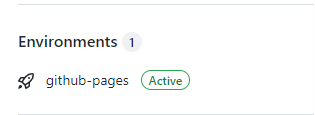

---

weight: 3

title: "Create a blog with Hugo on Github"


author: "mobilephone724"

tags: ["hugo"]

categories: ["blog"]

toc:

 enable: true

 auto: true

date: 2022-01-17T22:41:38+08:00

publishDate: 2022-01-17T22:41:38+08:00

---

## write ahead

my blog code would help you create your own blog https://github.com/mobilephone724/hugoBlog/

## create a blog on local

[Quick Start | Hugo (gohugo.io)](https://gohugo.io/getting-started/quick-start/)

### install hugo

[Install Hugo | Hugo (gohugo.io)](https://gohugo.io/getting-started/installing)

It seems installation on windows is a little harder. The following actions are based on **linux**

### create a new site

```bash
hugo new site quickstart
```

The above will create a new Hugo site in a folder named `quickstart`. Enter the folder `quickstart` which will be treated as the **root directory**

### choose a theme

I have tried many themes, and in the end, `LoveIt` is my favorite. So I use it to create my blogs.

Create an empty git repository(quickstart) and make this repository(LoveIt) a submodule of your site directory:

```bash
git init
git submodule add https://github.com/dillonzq/LoveIt.git themes/LoveIt
```

and configure ` config.toml` as what you want. If you can't understand it completely right now, just copy it.

copy everything from `themes/LoveIt/exampleSite`

```bash
cp -r themes/LoveIt/exampleSite/* .
```
then
1.	configure ` config.toml` as what you want. If you can't understand it completely right now, just copy it.
```
baseURL = "http://example.org/"
languageCode = "en-us"
title = "My New Hugo Site"
theme = "LoveIt"
enableRobotsTXT = true
enableEmoji = true

[languages]
  [languages.en]
  weight = 1
  languageCode = "en"
  languageName = "English"
  paginate = 12
    [languages.en.menu]
      [[languages.en.menu.main]]
        identifier = "posts"
        name = "Posts"
        url = "/posts/"
        title = ""
        weight = 1
      [[languages.en.menu.main]]
        identifier = "tags"
        pre = ""
        post = ""
        name = "Tags"
        url = "/tags/"
        title = ""
        weight = 2
      [[languages.en.menu.main]]
        identifier = "categories"
        pre = ""
        post = ""
        name = "Categories"
        url = "/categories/"
        title = ""
        weight = 3
      [[languages.en.menu.main]]
        identifier = "documentation"
        pre = ""
        post = ""
        name = "Docs"
        url = "/categories/documentation/"
        title = ""
        weight = 4
      [[languages.en.menu.main]]
        identifier = "github"
        pre = "<i class='fab fa-github fa-fw'></i>"
        post = ""
        name = ""
        url = "https://github.com/dillonzq/LoveIt"
        title = "GitHub"
        weight = 5
    [languages.en.params]
      description = "About LoveIt Theme"
      keywords = ["Theme", "Hugo"]
      [languages.en.params.app]
        title = "LoveIt"
        noFavicon = false
        svgFavicon = ""
        themeColor = "#ffffff"
        iconColor = "#5bbad5"
        tileColor = "#da532c"
      [languages.en.params.search]
        enable = true
        type = "algolia"
        contentLength = 4000
        placeholder = ""
        maxResultLength = 10
        snippetLength = 30
        highlightTag = "em"
        absoluteURL = false
        [languages.en.params.search.algolia]
          index = "index.en"
          appID = "PASDMWALPK"
          searchKey = "b42948e51daaa93df92381c8e2ac0f93"
      [languages.en.params.home]
        rss = 10
        [languages.en.params.home.profile]
          enable = true
          gravatarEmail = ""
          avatarURL = "/images/avatar.png"
          title = "hugoAuthor"
          subtitle = "something to share"
          typeit = true
          social = true
          disclaimer = ""
        [languages.en.params.home.posts]
          enable = true
          paginate = 6
      [languages.en.params.social]
        GitHub = "hugoAuthor"

[params]

  version = "0.2.X"
  defaultTheme = "light"
  dateFormat = "2006-01-02"
  images = ["/logo.png"]
  [params.header]
    desktopMode = "fixed"
    mobileMode = "auto"
  [params.header.title]
    name = "hugoAuthor"
    pre = "<i class='far fa-kiss-wink-heart fa-fw'></i>"
    typeit = false

  [params.footer]
    enable = true
    custom = ''
    hugo = false
    copyright = true
    author = true
    since = 2022
    license= '<a rel="license external nofollow noopener noreffer" href="https://creativecommons.org/licenses/by-nc/4.0/" target="_blank">CC BY-NC 4.0</a>'
  [params.section]
    paginate = 20
    dateFormat = "01-02"
    rss = 10
  [params.list]
    paginate = 20
    dateFormat = "01-02"
    rss = 10
  [params.page]
    hiddenFromHomePage = false
    hiddenFromSearch = false
    twemoji = false
    lightgallery = false
    ruby = true
    fraction = true
    fontawesome = true
    linkToMarkdown = true
    rssFullText = false
    [params.page.toc]
      enable = true
      keepStatic = false
      auto = true
    [params.page.code]
      copy = true
      maxShownLines = 10
    [params.page.math]
      enable = true
      blockLeftDelimiter = ""
      blockRightDelimiter = ""
      inlineLeftDelimiter = ""
      inlineRightDelimiter = ""
      copyTex = true
      mhchem = true
    [params.page.mapbox]
      accessToken = "pk.eyJ1IjoiZGlsbG9uenEiLCJhIjoiY2s2czd2M2x3MDA0NjNmcGxmcjVrZmc2cyJ9.aSjv2BNuZUfARvxRYjSVZQ"
      lightStyle = "mapbox://styles/mapbox/light-v10?optimize=true"
      darkStyle = "mapbox://styles/mapbox/dark-v10?optimize=true"
      navigation = true
      geolocate = true
      scale = true
      fullscreen = true
    [params.page.share]
      enable = true
    [params.page.comment]
      enable = true
      [params.page.comment.utterances]
        enable = false
        repo = ""
        issueTerm = "pathname"
        label = ""
        lightTheme = "github-light"
        darkTheme = "github-dark"
    [params.seo]
      image = "/images/Apple-Devices-Preview.png"
      thumbnailUrl = "/images/screenshot.png"

[markup]
  [markup.highlight]
    codeFences = true
    guessSyntax = true
    lineNos = true
    lineNumbersInTable = true
    noClasses = false
  [markup.goldmark]
    [markup.goldmark.extensions]
      definitionList = true
      footnote = true
      linkify = true
      strikethrough = true
      table = true
      taskList = true
      typographer = true
    [markup.goldmark.renderer]
      unsafe = true
  [markup.tableOfContents]
    startLevel = 2
    endLevel = 6

[mediaTypes]
  [mediaTypes."text/plain"]
    suffixes = ["md"]

[outputFormats.MarkDown]
  mediaType = "text/plain"
  isPlainText = true
  isHTML = false

[outputs]
  home = ["HTML", "RSS", "JSON"]
  page = ["HTML", "MarkDown"]
  section = ["HTML", "RSS"]
  taxonomy = ["HTML", "RSS"]
  taxonomyTerm = ["HTML"]
```

2.	remove  `content/about` because it may lead to that github can't show your page
```
rm -r content/about/
```

3.	remove anything in `content/posts`, and next section will help you write your own post
```
rm -r content/posts/*
``` 

### create your first post

I don't like the way on [Quick Start | Hugo (gohugo.io)](https://gohugo.io/getting-started/quick-start/) to create a post, for inserting pictures can be undesirable. The best way for me now it as follows

```bash
cd content/posts
mkdir my_first_post
cd my_first_post
mkdir pic 		# create a directory to store pictures.
touch index.md
```

The advantage is that the `path` of pictures is like `pic/picture.png`. It is very similar to the way to write in `typora`

notice that you can use multi-level directories like

```bash
ubuntu@VM-4-13-ubuntu:~/quickstart/content/posts$ tree .
.
├── APUE
│   └── chapter3
│       ├── index.md
│       └── pic
│           ├── file.png
│           ├── Screenshot-2021-05-04-19-58-12.png
│           ├── Screenshot-2021-05-04-20-40-06.png
│           └── Screenshot-2021-05-05-09-34-21.png
```

then write something to `index.md`

```markdown
---
weight: 3
title: "my first post"
author: "hugoAuthor"
tags: ["hugo","LoveIt"]
categories: ["blog"]
toc:
  enable: true
  auto: true
date: 2022-01-14T23:43:08+08:00
publishDate: 2022-01-14T23:43:08+08:00
---

# add a chapter

some content


```

and save this picture to `content/posts/my_first_post`


and now see your blog on website

```
hugo server #in directory quickstart
```

open website at `http://localhost:1313/` to see your blog


## show your blog on github page
The following action will help pushing your blog on github
### create a github account

It may be quite easy for you do so. Suppose your github user name is `hugoAuthor`

### create a repo

The repo's name must be like `hugoAuthor.github.io` and visibility must be `public`

find `baseURL = "http://example.org/"` in, config.toml, modify the value to your github website like `baseURL = "https://hugoAuthor.github.io/"`

### push your blog to github page

in `quickstart` directory

```bash
hugo
```

This command will create a directory named `public` in which is what all we need to show our blog.

What we'll do following is push  content in `public` to the repo you just created.

```
cd public
git init
git add .
git commit -m "first commit"
git remote add origin https://github.com/hugoAuthor/hugoAuthor.github.io.git
git push origin master
```

Open the website of your repo then wait until you see `active` on `Environments`



Now you can see your blog on  `hugoAuthor.github.io`

## more details

### post head

The head I use is like
```
---
weight: 3
title: "your first post"
author: "hugoAuthor"
tags: ["hugo","LoveIt"]
categories: ["blog"]
toc:
  enable: true
  auto: true
date: 2022-01-14T23:43:08+08:00
publishDate: 2022-01-14T23:43:08+08:00
---
```

`weight: 3` means the weight of this post. The smaller the weight is, the position of this post is higher in homepage. For example, if you need a post to always be at top of homepage, you can use `weight: 1` in that post.

`tags: ["hugo","LoveIt"]` , `categories: ["blog"]` add tags and categories of this post, you can see all tags and categories at the top-right corner


`toc:` add table of contents

To write date conveniently, use the script
```sh
date +'%Y-%m-%dT%H:%M:%S+08:00'
```

### add comment area

1.	create an empty public repo in github, named as hugoTalk
2.	open [utterances app](https://github.com/apps/utterances) ,click install
3.	config utterances at https://github.com/apps/utterances
4.	modify `config.toml` at `[params.page.comment.utterances]`, enable it and copy your hugoTalk url to `repo`
5.	publish your blog and you will see the comment area.

[this blog may help you do so](https://cloud.tencent.com/developer/article/1834230)