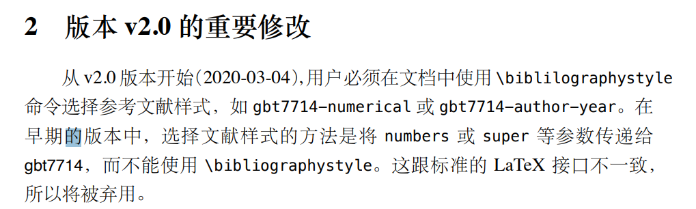

---

weight: 3

title: "sys-thesis v0.5踩坑记录"


author: "mobilephone724"

tags: ["hugo"]

categories: ["blog"]

toc:

 enable: true

 auto: true

date: 2022-01-23T11:36:54+08:00

publishDate: 2022-01-23T11:36:54+08:00

---

**使用的发行版为0.5, 使用环境为ubuntu**

### 卸载旧版本latex

```bash
sudo rm -rf /usr/local/texlive/*
sudo rm -rf /usr/local/share/texmf
sudo rm -rf /var/lib/texmf
sudo rm -rf /etc/texmf
sudo apt remove tex-common --purge
find -L /usr/local/bin/ -lname /usr/local/texlive/*/bin/* | sudo xargs rm
```

### 安装新版本latex

[下载late镜像](https://mirrors.tuna.tsinghua.edu.cn/CTAN/systems/texlive/Images/)

加载镜像文件(注意，我的mnt目录下没有挂在其他东西)

```bash
sudo mount -o loop texlive.iso /mnt
```

启动安装程序

```c
cd /mnt 
sudo ./install-tl
```

卸载镜像文件

```bash
cd /
sudo umount /mnt
```

### 设置环境变量

在`~/.bashrc`的末尾加入如下路径，把2020换成对应的版本（2021）

```bash
export PATH=$PATH:/usr/local/texlive/2020/bin/x86_64-linux
export MANPATH=/usr/local/texlive/2020/texmf-dist/doc/man
export INFOPATH=/usr/local/texlive/2020/texmf-dist/doc/info
```

再`source ~/.bashrc`即可

### 修改sys-thesis代码

进入该目录，执行如下命令

```bash
sudo apt-get update
sudo apt-get install -y git language-pack-zh-hans language-pack-zh-hant
mkdir -p /usr/share/fonts/opentype
git clone https://github.com/a20185/adobefonts
chmod +x adobefonts/runner.sh
sudo adobefonts/runner.sh
fc-cache -f -v
sed -i 's/Times New Roman/Nimbus Roman No9 L/g' sysuthesis.cls
rm -Rf adobefonts
```

具体原因可参考`.gitlab-ci.yml`文件

### 验证是否成功

删掉文件`main.pdf`,执行命令 `make pdf`,查看生成的`main.pdf`和github上的原版内容是否相同

### 需要更新latex版本的原因

[应该是bibtex的原因](https://ctan.math.illinois.edu/biblio/bibtex/contrib/gbt7714/gbt7714.pdf)


使用19版本除了参考文献无法显示除外，`\autoref`也无法正常使用，但是更新到2021版本就无该问题。

### Dockerfile中下载的texlive应该也不是新版！编译出错